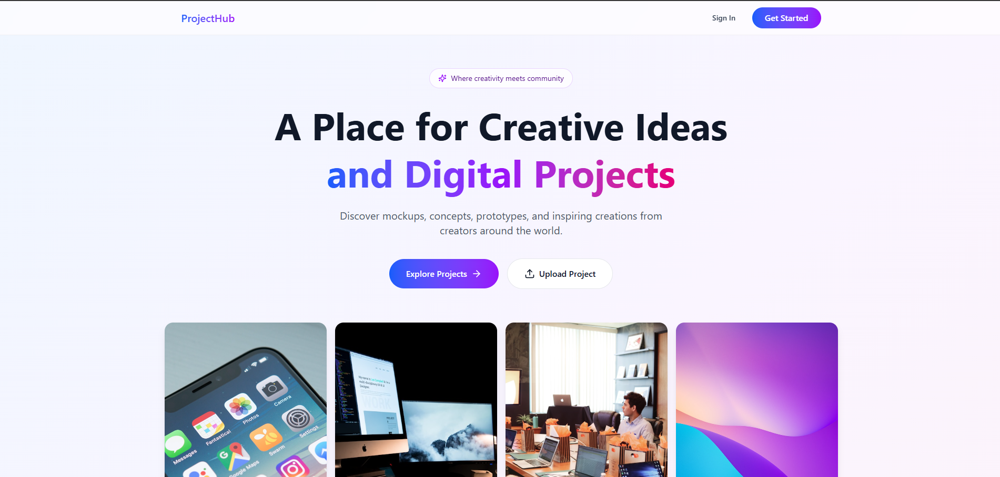
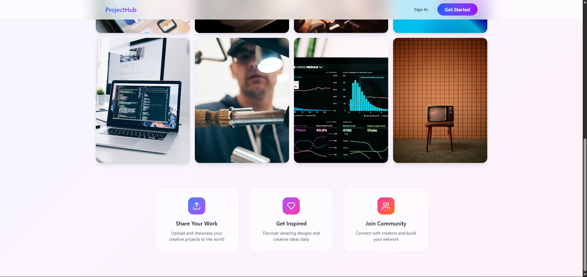
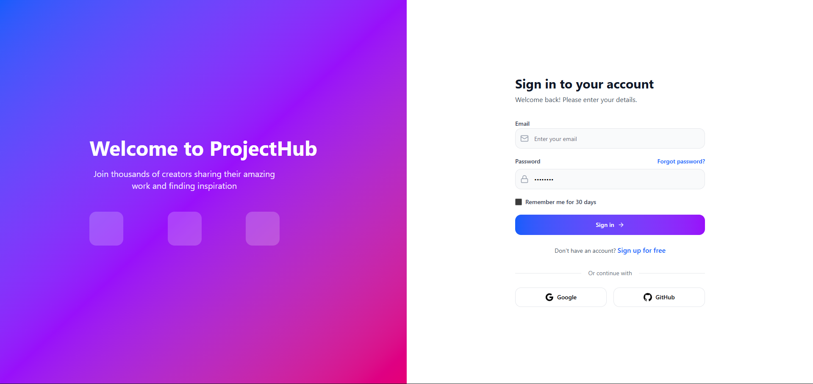
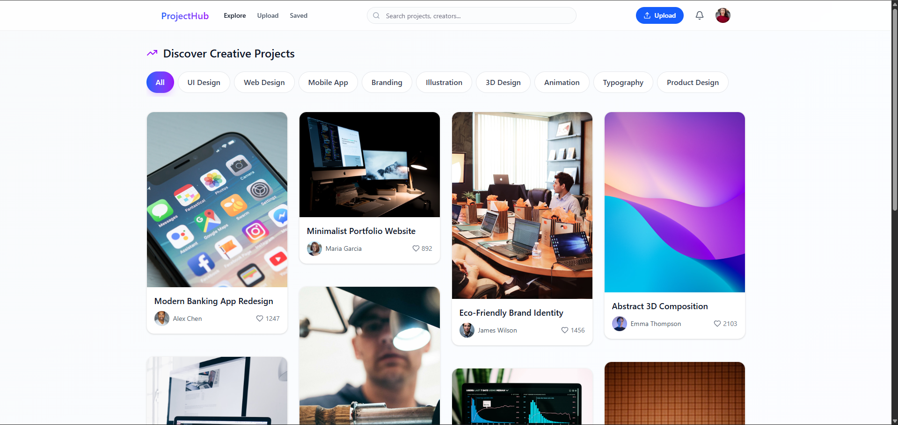
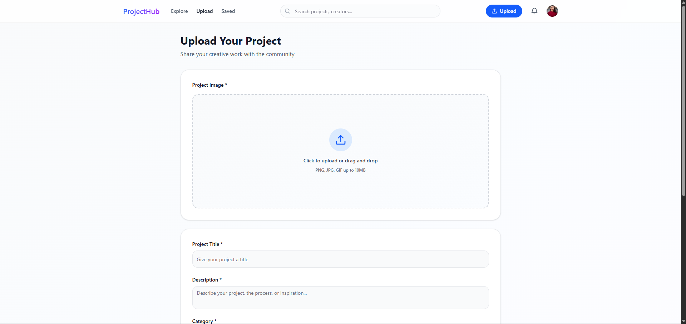
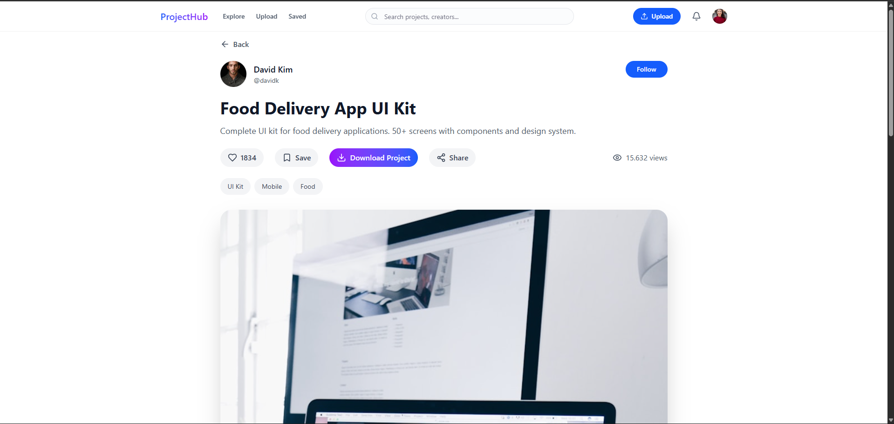
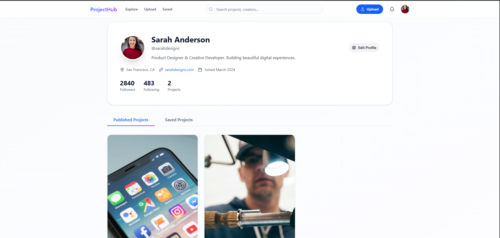

# Requisitos Funcionales

## Módulo de Autenticación y Gestión de Usuarios

### RF-01
El sistema deberá permitir el registro e inicio de sesión de usuarios mediante credenciales únicas asociadas a correo electrónico y contraseña.

### RF-02
El sistema deberá permitir la recuperación de contraseña mediante correo electrónico para facilitar el acceso seguro de los usuarios.

### RF-03
La plataforma deberá permitir a los usuarios administrar y editar su perfil personal, incluyendo fotografía, descripción, enlaces externos y categorías o tecnologías de interés.

### RF-04
El sistema deberá permitir el cierre de sesión seguro y la gestión básica de preferencias de usuario dentro de la plataforma.

---

## Módulo de Gestión de Proyectos

### RF-05
La plataforma deberá permitir a los usuarios crear y publicar proyectos digitales mediante formularios estructurados.

### RF-06
El sistema deberá permitir subir contenido multimedia asociado a los proyectos, incluyendo imágenes, mockups y recursos visuales.

### RF-07
Cada proyecto deberá permitir el registro de información como título, descripción, categoría, tecnologías utilizadas, dificultad y estado de desarrollo.

### RF-08
El sistema deberá permitir clasificar los proyectos según estados como idea, prototipo, en desarrollo o finalizado.

### RF-09
La plataforma deberá permitir editar o eliminar proyectos previamente publicados por el usuario.

### RF-10
El sistema deberá mostrar una vista detallada de cada proyecto con toda su información organizada de manera visual e interactiva.

---

## Módulo de Exploración y Descubrimiento

### RF-11
El sistema deberá ofrecer un espacio de exploración donde los usuarios puedan descubrir proyectos publicados por la comunidad.

### RF-12
La plataforma deberá incluir un sistema de búsqueda mediante palabras clave relacionadas con proyectos o tecnologías.

### RF-13
El sistema deberá permitir filtrar proyectos por categoría, popularidad, dificultad, fecha de publicación y tecnologías utilizadas.

### RF-14
La plataforma deberá mostrar proyectos destacados o en tendencia según la interacción generada por los usuarios.

### RF-15
El sistema deberá recomendar proyectos relacionados según categorías o intereses similares.

---

## Módulo de Interacción Social

### RF-16
La plataforma deberá permitir a los usuarios comentar proyectos publicados por otros usuarios.

### RF-17
El sistema deberá permitir reaccionar a proyectos mediante likes o guardarlos en favoritos.

### RF-18
La plataforma deberá permitir seguir perfiles de otros usuarios para visualizar sus nuevas publicaciones.

### RF-19
El sistema deberá generar notificaciones relacionadas con comentarios, seguidores e interacciones relevantes.

---

## Módulo de Estadísticas y Dashboard

### RF-20
El sistema deberá proporcionar un dashboard personalizado donde cada usuario pueda visualizar estadísticas relacionadas con sus proyectos e interacciones.

### RF-21
El administrador deberá contar con un panel de control general para visualizar métricas globales de uso, actividad y proyectos destacados dentro de la plataforma.

---

## Módulo Administrativo

### RF-22
El sistema deberá permitir al administrador gestionar usuarios registrados dentro de la plataforma.

### RF-23
La plataforma deberá permitir la moderación y eliminación de contenido inapropiado o que incumpla las políticas de uso.

### RF-24
El administrador deberá poder gestionar categorías, etiquetas y configuraciones generales de la plataforma.

### RF-25
El sistema deberá permitir al administrador supervisar estadísticas y reportes generales sobre el funcionamiento de la plataforma.

# Requisitos No Funcionales

## Usabilidad

### RNF-01
La plataforma deberá contar con una interfaz moderna, intuitiva y visualmente atractiva que facilite la navegación y exploración de proyectos digitales.

### RNF-02
El diseño de la aplicación deberá estar orientado a ofrecer una experiencia de usuario fluida, organizada y accesible para usuarios con diferentes niveles de experiencia tecnológica.

### RNF-03
La plataforma deberá implementar principios de Diseño Centrado en el Usuario (UCD) para garantizar facilidad de aprendizaje y uso.

### RNF-04
El sistema deberá proporcionar mensajes claros de validación, error y confirmación durante las interacciones del usuario.

### RNF-05
La interfaz deberá mantener consistencia visual y funcional en todas las secciones de la plataforma.

---

# Rendimiento

### RNF-06
El sistema deberá responder a las acciones del usuario en un tiempo inferior a 2 segundos en operaciones comunes como navegación, búsquedas y carga de contenido.

### RNF-07
La plataforma deberá soportar múltiples usuarios conectados simultáneamente sin degradar significativamente el rendimiento del sistema.

### RNF-08
El sistema deberá optimizar la carga de imágenes y contenido multimedia para garantizar una experiencia de navegación fluida.

### RNF-09
La plataforma deberá minimizar tiempos de espera durante procesos de publicación, búsqueda y exploración de proyectos.

---

# Seguridad

### RNF-10
El sistema deberá garantizar la protección de credenciales mediante cifrado seguro de contraseñas y manejo seguro de sesiones.

### RNF-11
La plataforma deberá implementar mecanismos de validación y sanitización de datos para prevenir ataques comunes como SQL Injection y Cross-Site Scripting (XSS).

### RNF-12
El sistema deberá garantizar la privacidad y confidencialidad de la información de los usuarios registrados.

### RNF-13
La plataforma deberá restringir accesos no autorizados a funciones administrativas o información sensible.

---

# Portabilidad

### RNF-14
La aplicación web deberá funcionar correctamente en navegadores modernos como Google Chrome, Mozilla Firefox, Microsoft Edge y Safari.

### RNF-15
La plataforma deberá ser responsive y adaptable a diferentes tamaños de pantalla, incluyendo computadores, tablets y dispositivos móviles.

### RNF-16
La interfaz deberá mantener consistencia visual y funcional independientemente del dispositivo utilizado.

---

# Escalabilidad

### RNF-17
La arquitectura del sistema deberá permitir el crecimiento progresivo de usuarios, proyectos y contenido multimedia sin afectar el funcionamiento general de la plataforma.

### RNF-18
La base de datos deberá soportar almacenamiento y administración eficiente de grandes volúmenes de información y recursos visuales.

---

# Mantenibilidad

### RNF-19
El código fuente deberá seguir estándares de programación y buenas prácticas de desarrollo para facilitar futuras actualizaciones y mantenimiento.

### RNF-20
La aplicación deberá desarrollarse mediante una arquitectura modular que permita agregar nuevas funcionalidades sin afectar significativamente los módulos existentes.

### RNF-21
La estructura del sistema deberá facilitar la detección y corrección de errores durante futuras etapas de desarrollo.

---

# Disponibilidad

### RNF-22
La plataforma deberá tener una disponibilidad mínima del 99% durante su funcionamiento.

### RNF-23
El sistema deberá incluir mecanismos básicos de recuperación ante fallos para minimizar pérdida de información o interrupciones del servicio.

---

# Interoperabilidad

### RNF-24
La plataforma deberá utilizar formatos estándar para el intercambio y almacenamiento de datos.

### RNF-25
El sistema deberá permitir futuras integraciones con APIs o servicios externos relacionados con autenticación, almacenamiento o análisis de datos.

---

# Fiabilidad

### RNF-26
El sistema deberá validar correctamente la información ingresada por los usuarios para prevenir inconsistencias en los datos almacenados.

### RNF-27
La plataforma deberá garantizar la integridad y consistencia de la información registrada dentro del sistema.

### RNF-28
El sistema deberá mantener estabilidad operativa durante procesos simultáneos de navegación, publicación e interacción de usuarios.

# Mockup
### Mockup Figma: 
https://www.figma.com/make/qIzYrbRLWikN5Kkm2BL4nM/Design-ProjectHub-Creative-Platform?t=lvThxRxVcRnTdHiF-1&preview-route=%2Fproject%2F2

## Home

  

  

## Login

  

## Principal Page

  

## Upload Project

  

## View Project

  

## Profile

  

